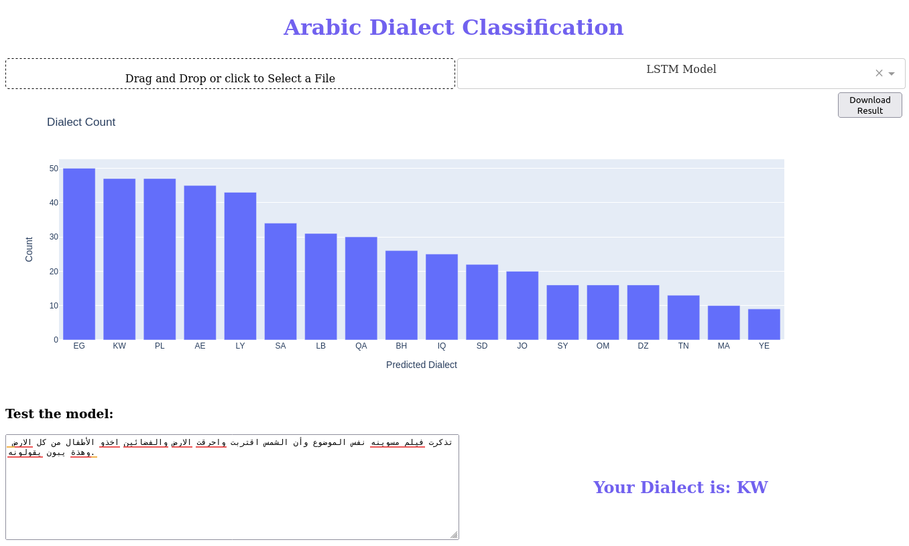

# Arabic Dialects Identification

There are many Arabic countries, and every country has its own dialect, 
some of them are similar and some are totally different.  

In this repo I've created 2 machine learning models (LSTM model, and a pipeline of a TFIDF Victorizer and a Random Forest) to classify 18 dialects.   

To be able to run the app and the notebooks, you should have [`daar`]("https://pypi.org/project/daar/"), a tiny package  I've created especially for this task(original files are in helpers folder), you can install it with all other packages using `pip install -r requirements.txt`

To run the app, you have 2 options:
- Option_1:
    - `git clone https://github.com/Ahmed-Elshehawy/arabic-dialects-identification.git`
    - `cd "arabic-dialects-identification"`
    - `pip install -r requirements.txt` 
    - `mkdir app/no_stem/models` # create new directory(models) inside app/no_stem/
    - download [LSTM model](https://www.kaggleusercontent.com/kf/90088475/eyJhbGciOiJkaXIiLCJlbmMiOiJBMTI4Q0JDLUhTMjU2In0..bNTluRhq_tzXJ1OinjDx_w.905yaFn0eZbWJuUOuP2YmRbJZx6a03LjRmmfyjtUByDS1shO-QDUVvu11EyGqtPgmitfIerY3rEty3bqVb1lton5cpf5LDKD7k3sdeq85QlkHAXRL0BO5nKj2OFb9EKPCDQOIsqnb9l1hDzgzO35tFNVb41Co4yDQPW4-FfTv-xa4UH3Jy02jBKdlG0LBMILL16DTsjuOTYpuEjNyXu3VSEzPtK1hQ4Qzn2E1AJjo54dG3I50fPtlMaN70WdSiMufQiH-LleI-qn64AFJ5ro303GAcz29GKxKe8gdjREnp7FpdMOkhFRQyGxi_Fww40-jyDhvwfM4Fzr1GyMYVqzeaWNi3o7pmO2kQGJIuQm22BFPPFGZ9ZQjWQbsGvmiMtmNUYpXApMlQ5S8ZKZwLq-6DWQkhkS90a7ol9YxG3-v0ukmN32cxIwmQLipEN2bNhoTRNhWAEiht6PHjAEC5O6niL-zjEDBkh0NzgnUlDGsDWjj2miO3aEQPF63pVjdOm8MvSKKieJ-2uocF0HbHlDvrwzU7xNVVY9-fzlGixLqIzfRDCIyVqa6WE3vKrLF4tfzs5VcQkrvX34F1WNiO7IIg_7Mq_-Vkw2t9PEF1KC-4wMw_UlzjJrtPcA5PG0rD9Xco1w57H4y5xlkNK6GwStFg.f2sBlnVkKfy4NpDbGdabfw/best_model.pt)  and [ML model](https://www.kaggleusercontent.com/kf/89869800/eyJhbGciOiJkaXIiLCJlbmMiOiJBMTI4Q0JDLUhTMjU2In0..jrBHiUHSMUzCHQUNe1md1A.wVK5ouAbqzoZQxNMflqFE2k6IYgGREoAexJLjhoUY-mit7rLAlmcgoH2iICHk5ktpFppy83Wy-HMTZa4b1Lg2dDYhKI46Dso_LSeuUwXIUBoUVJv-NF9d5g1MCLwJU8KjLy-MrZNglu7gBSxx2-J1KCEBw4klPz7Qe1LqapelNpK8txfx-VTBr0SRnXIGsib9zxhEjmNHN4nLBuc91pde5mp8Q7ZzSA4fji58jtY_17RnDnWUXyMpGTPVvaaEgNvY1uSQ1c1qtvp3P6oualj8BfAirTbkUQ_G2BTog4GsqG6w4HsrAb3Nf4mVddkjmTHwQL-VEedW6LPV7ZgpJWgFNfVSRccsEXSLhbRALS1N06_5Vz0U0-EMjF7nEfLBug0KMrshltOl2H4E2FY-u8irSBX89qNJ9ticK5le0k8SY8YQ4bvSYONTHqHqMCUm-zBpkonP_tGfNsd3aFfHLXQ4qXsHvncG8N-oYcsubwsg_UFQkKMnjrbarpyiLcMRyWLcyQDZetWHCjpZ0jklR0mMySFz0-Ez5Ag-EBskY8oOHhhW3sBUeEI3TXrVi5i-HxAqYYAPLjG0BMhuZ4Cdw23Pd3j_zUorn7-dBwu7kjx4NE-Wrim6eknk0rHPQrli8OkBqAT4sTkf2-fiQN2-4xkXklTIDAthYznvC-jLyy3Zts.fk_yvtKligLYvQe1uWl6Eg/pipe_rf_20.obj) in this directory
    - run `python3 app.py`

- Optin_2: 
    - download `Dockerfile`
    - in the same directory run `docker build -t <your image name> .`
    - run `docker create -p <your port number>:1111 --name <your container name> <your image name>`
    - run `docker start <your container name>` # to start the app
    - open `http://localhost:<your port number>/` in your browser
    - to stop the app: run docker `stop <your container name>`

## After running app (it may take some time to start):
- you can upload any csv file (*must have column called "text"*), feel free to use `sample.csv` file in this repo
- select the model you want
- the model will start to make predictions (based on no stemming data pipeline) and store them in a dataframe
- then the app will use this dataframe to display a plot showing the frequncy of each dialect
- a plot with dialect cout will appear on the screen, 
- by clicking `Download result` button, you can download a csv file `result.csv` containing 2 columns 
    - text: the original text
    - pred_dialect: the predicted dialect
- also, you can download the plot by hovering it and click download
- **In addition to that you can test the model by typing your own text**

## Example:

